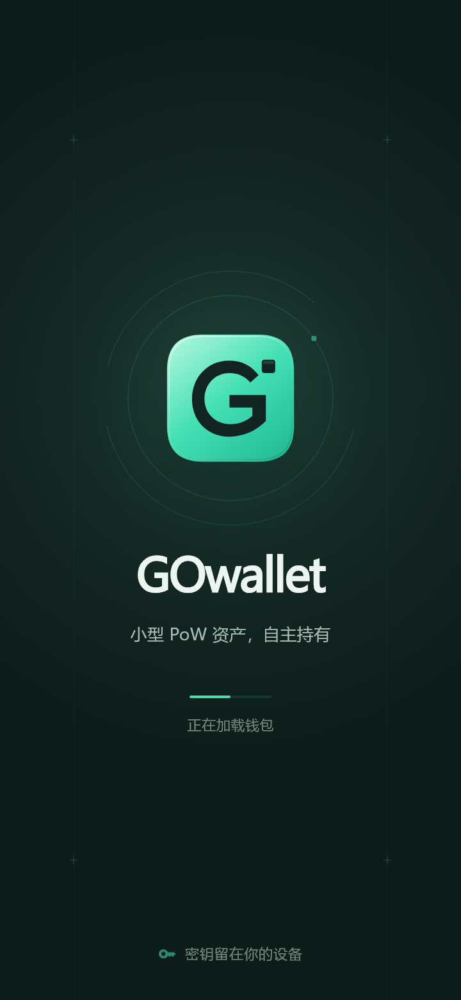
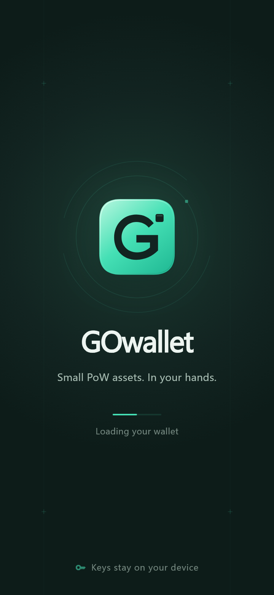
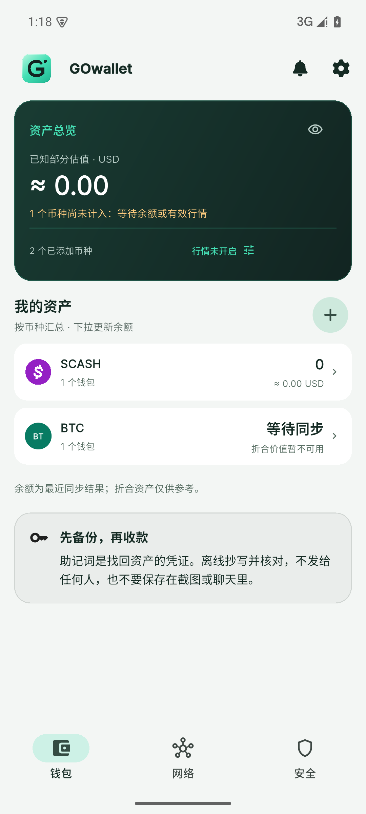
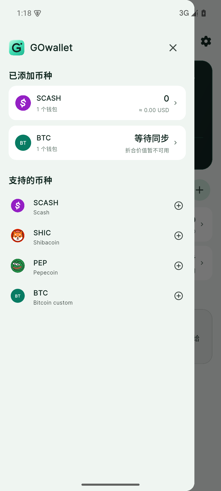
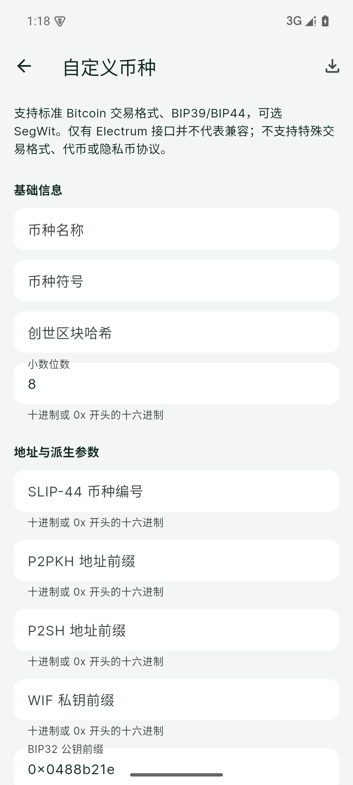
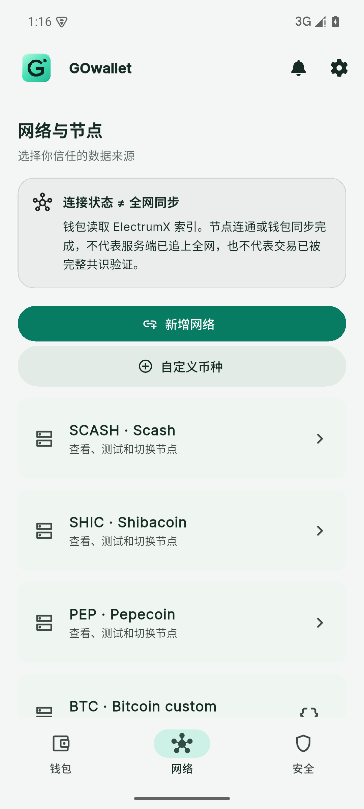
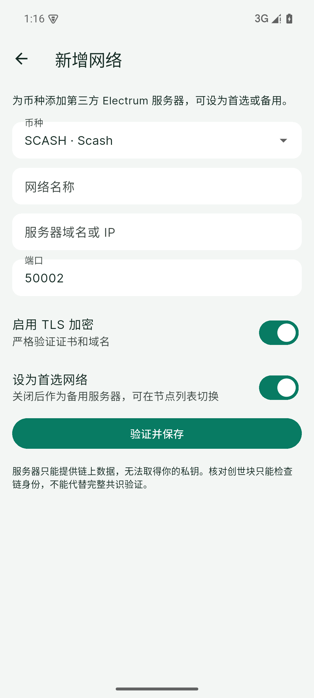
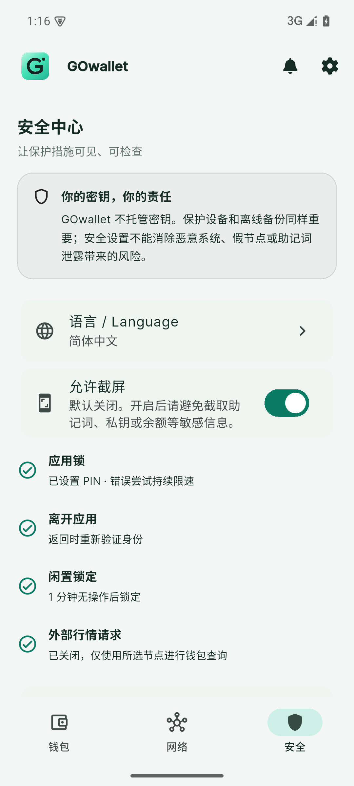

# GOwallet 1.0

面向小型 PoW 币种的开源、非托管 Android 钱包。当前版本 **1.0.1（versionCode 10）**，支持 SCASH、SHIC、Pepecoin（PEP），以及交易格式兼容的自定义 Electrum 币种与网络。

[下载正式版](https://github.com/AlexZeroZero/GOwallet/releases/tag/v1.0.1) · [English](docs/README.en.md) · [安全审核与验证](docs/SECURITY-REVIEW.md) · [1.0.1 修复与文件校验](docs/VERIFICATION-1.0.1.md) · [构建源码](docs/BUILD.md)

 

上图为实际 Flutter 启动画面渲染预览；手机上的系统图标形状和启动时序取决于 Android 设备。

## APP 演示截图

下图直接截取自 1.0.0 正式 APK 的 Android 测试模拟器，使用无真实资金的演示钱包。未制作虚假余额；“等待同步”和未计入估值是实际界面状态。BTC 为自定义兼容币种示例。安全页的截屏开关仅为制作演示临时开启，拍摄后已恢复关闭；默认仍禁止截屏。

| 资产首页 | 币种侧栏 | 自定义币种 |
| --- | --- | --- |
|  |  |  |

| 网络与节点 | 新增 Electrum 网络 | 安全中心 |
| --- | --- | --- |
|  |  |  |

[查看全部 8 张中英文截图与原图](docs/SCREENSHOTS.md)。

## 功能

- 中文、英文界面，紧凑资产首页、币种侧栏与统一 GOwallet 视觉。
- 本地创建、恢复钱包与交易签名；收款、发送、余额及交易记录查询。
- SCASH、SHIC、PEP 默认使用 TLS Electrum 节点；可以添加自己的 TCP/TLS 节点。
- 可配置兼容币种的网络参数。自定义参数不等于自动支持所有小币，必须确认地址、派生路径和交易签名格式兼容。
- PIN、后台锁定、默认禁止截图；可在安全设置中手动允许截图。
- 加密备份；新建备份口令至少 12 个 Unicode 字符，建议使用独立的随机长口令。

## 非托管式钱包

助记词生成、私钥派生和交易签名在设备本地完成。正常钱包协议不会把助记词、私钥或备份口令发送给 Electrum 节点。开发者不代管资产，也无法重置助记词、找回丢失的私钥或撤销已确认交易。

请离线妥善保管助记词。拥有助记词的人可以控制资产；手机 PIN 不能替代助记词备份。被控制的操作系统、恶意输入法/无障碍服务、主动截图或泄露备份仍可能造成资产损失。

## Electrum 如何工作

### 节点服务与责任边界

**GOwallet 是非托管式钱包客户端。所连接的节点由相关币种项目官方或第三方节点运营者独立部署、运行和维护，APP 不托管用户资产，也不保证节点持续在线或返回的数据始终准确。** 节点是否属于项目官方，以该项目公布的信息为准；被 GOwallet 收录不代表官方认证。

**因节点自身故障、停机、攻击、同步延迟、错误响应或停止服务引起的连接、余额显示、交易查询或广播问题，属于节点服务侧问题，与 GOwallet APP 软件本身无关。** 可尝试切换兼容节点并核实链上状态；节点离线本身不会改变链上资产归属。若问题来自 APP 自身逻辑或安全缺陷，应按 APP 问题反馈处理。

```text
GOwallet：本地密钥、构造与签名交易
    │ TLS（推荐）或 TCP（明文）
    ▼
Electrum / ElectrumX：查询历史、UTXO、费用，转发已签名交易
    ▼
对应币种的全节点与区块链网络
```

钱包核心功能不依赖专有的应用账户服务器，但仍需要可用的 Electrum 服务及其后端节点。法币估值等辅助功能可能请求独立行情 API。更换兼容节点无需转移助记词或链上资产。

当前不是完整 SPV 钱包：没有完整验证区块头 PoW、Merkle 包含证明和链选择。已增加签名前的原始输入交易哈希、金额和脚本核验，但这不证明输入已确认或未花费。节点仍可隐藏交易、谎报确认数、拒绝广播，或关联查询 IP 与 script hash。TLS 保护链路，并不保证节点诚实。详见 [Electrum 与隐私边界](docs/ELECTRUM.md)。

## 查毒、安全审核与验证

发布包的实际扫描结果、SHA-256、签名指纹和验证步骤在 [查毒验证说明](docs/VERIFICATION.md) 及 Release 附件中公开。源码复核、攻击模拟、依赖公告扫描和验证限制见 [安全审核记录](docs/SECURITY-REVIEW.md)。

1.0.1 修复了 Android 安全存储错误回退及迁移可靠性问题，并补齐 SQLite 原生编译加固。98 项 Dart 回归、17 项 Android 存储测试及同签名覆盖安装验证通过；ClamAV 感染文件 0。详见 [1.0.1 修复、完整报告与仍未修复项](docs/VERIFICATION-1.0.1.md)。Isar 加固告警仍待处理。

1.0.0 历史 [MobSF 自动扫描完整报告与告警说明](docs/AUTOMATED-SECURITY.md)：官方 v4.5.2 在本地隔离环境扫描同一正式 APK，评分 **59/100**；Scorecard 为 **1 high、7 warning**，原生库另有加固告警，均保留公开。提供 PDF、JSON、日志和校验值。**这是第三方工具的自托管扫描，不是独立机构审计通过；VirusTotal 多引擎结果尚未取得。**

这些检查不是“绝对无毒/无漏洞”保证，也不是独立第三方审计认证。下载后应核对当前版本的哈希和签名，不能用旧版本校验值验证新版文件。

## 安装与升级

支持 Android 7.0 / API 24 及以上，发布 APK 包含 ARM64 和 x86_64。包名 `org.gowallet.pow`。1.0 延用此前 GOwallet 发布签名，支持从同签名旧版覆盖安装；升级前备份，**不要为升级先卸载钱包**。本次没有发布或验证 iOS/桌面安装包。

## 开源与来源

采用 [GPLv3](LICENSE)。基于 Stack Wallet 二次开发 / Cypher Stack 的代码与版权；上游来源和第三方依赖见 [NOTICE](NOTICE.md)。GOwallet 是独立衍生项目，不代表上游官方背书。

公开仓库从经过整理的源码快照开始，包含构建模板、资源、锁定依赖和安全测试；不包含开发机运维日志、钱包数据或发布私钥。问题反馈请勿粘贴助记词、私钥、备份文件或未脱敏日志；漏洞披露方式见 [SECURITY.md](SECURITY.md)。
