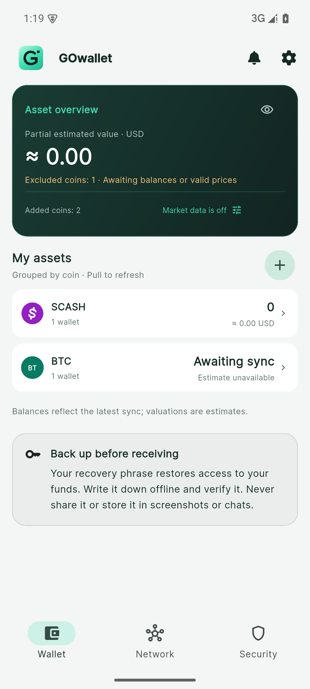
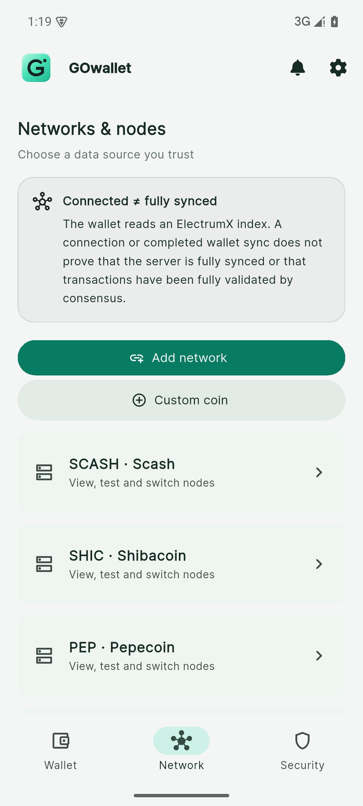

# GOwallet 1.0.0 演示截图 / Screenshots

以下 8 张图片直接来自正式签名 APK `1.0.0+9`，Android API 35 测试模拟器，1080 × 2400。拍摄日期：2026-09-07。使用公开测试向量建立的无真实资金钱包，不包含用户助记词、私钥或备份文件。图片未伪造余额或连接状态；不是所有节点在线、已完成同步或支持全部 Electrum 币种的证明。

中文与英文首页中的 BTC 是自定义兼容币种示例，显示等待同步；法币行情请求关闭。长表单与列表可继续滚动，截图只展示当前视窗。安全中心截图中“允许截屏”是为演示临时开启，结束后已经恢复关闭并验证黑屏保护；正式版默认关闭。

These are unedited captures from the signed release APK on a test emulator, using unfunded public test fixtures. BTC demonstrates a custom compatible coin. Pending synchronization and unavailable valuation are real UI states. Screenshot permission was temporarily enabled for these captures and restored afterwards; it remains off by default. No private wallet data is shown.

| 中文资产首页 | 币种侧栏 |
| --- | --- |
|  |  |

| 网络与节点 | 新增网络 |
| --- | --- |
|  |  |

| 自定义币种 | 安全中心 |
| --- | --- |
|  |  |

| English home | English networks |
| --- | --- |
|  |  |

原图和节点说明补充包见 [v1.0.0 Release](https://github.com/AlexZeroZero/GOwallet/releases/tag/v1.0.0)。本次仅增加演示图片和文档，不更换 APK、版本标签或已有查毒结果。[非托管及节点责任边界](ELECTRUM.md)。
